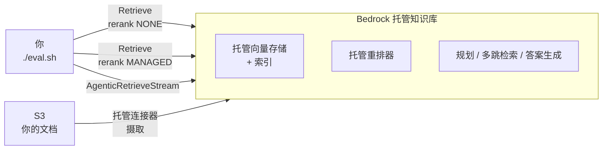

# 托管知识库（Managed KB）评测 Demo

Amazon Bedrock 的**托管知识库**让你不用再开向量数据库：建一个 KB、把文档扔进 S3，
检索、嵌入、重排、多跳推理全部由服务托管。AgentCore 控制台里新出现的「知识库（KB）」
入口指向的就是它。

这个 demo 不只是把它跑起来，而是**给它打分**。同一个知识库、同一批问题，
三种检索方式各跑一遍，用带标准答案的题目量化差距：

| 档位 | 调什么 | 一句话 |
|---|---|---|
| 纯向量 | `Retrieve`，重排关闭 | 一次向量搜索，一个来回 |
| 托管重排 | `Retrieve`，重排 `MANAGED` | 同一次搜索，服务再排一遍序 |
| 多跳 | `AgenticRetrieveStream` | 服务自己拆子问题、多次检索、直接写答案 |

**不需要装任何东西**，在 AWS CloudShell 里复制粘贴三行命令即可。

---

## 跑起来（约 5 分钟）

打开 [AWS CloudShell](https://console.aws.amazon.com/cloudshell/home)（控制台右上角的
终端图标），粘贴：

```bash
git clone https://github.com/quanquan1996/managed-kb-eval-demo.git
cd managed-kb-eval-demo
./deploy.sh
```

脚本建好知识库、上传语料、建索引，等它打印 `Index ready.` 就能用了。
实测建栈 67 秒，建索引约 2 分半。

### 先随便问一句

```bash
./ask.sh "华东一台 EM-300，2023 年 5 月出厂，反复上报 E207，要换表吗？需要报备吗？"
```

它会先打印服务内部的流水线步骤，再给答案。这题的答案不在任何单篇文档里，
需要把固件版本、错误码判据、保修政策、区域报备四份文档拼起来。

### 再跑评测

```bash
./eval.sh
```

11 道题 × 3 档，实测 138~140 秒。输出是逐题明细加汇总表。

### 清理

```bash
./cleanup.sh
```

删得干干净净，不留任何资源。

---

## 评测结果（us-west-2 实测）

语料是虚构公司「AnyCompany 智能电表」的 5 份中文售后文档（`sample-data/docs/`，
全部为编造的合成数据）。11 道题在 `sample-data/questions.json` 里，
每题都标了**必须命中哪几篇文档**和**答案里必须出现哪些事实**。

`./eval.sh` 默认 `--top-k 3`。跑三次的结果，前三列**三次完全一致**：

| 档位 | 文档召回 | 证据里的事实覆盖 | 答案里的事实覆盖 | 中位耗时 |
|---|---|---|---|---|
| 纯向量 | 72.2% | 78.7% | — | 0.7s |
| 托管重排 | 77.8% | 89.8% | — | 0.7s |
| 多跳 | **88.9%** | **96.3%** | 89.8% / 92.6% / 89.8% | 8.5~9.5s |

按题型拆开，差距全部来自多跳题：

| 题型 | 纯向量 | 托管重排 | 多跳 |
|---|---|---|---|
| 单跳（4 题） | 100% | 100% | 100% |
| 多跳（5 题） | 50% | 60% | **80%** |

两道故意问库里没有的问题（采购单价、代理商申请），多跳档两次都正确拒答，没有编。

三个可以直接拿走的结论：

- **单跳题不值得上多跳。** 三档都是 100%，而多跳慢十几倍。
- **托管重排几乎免费。** 中位耗时从 0.6s 到 0.7s，证据事实覆盖从 78.7% 涨到 89.8%。
  如果你只改一个参数，改这个。
- **多跳的开销是自适应的，不是固定的。** 见下一节。

### 多跳档的耗时花在哪

`AgenticRetrieveStream` 会把内部步骤作为 trace 事件流出来。实测里它对简单问题和
复杂问题的行为明显不同（下面是第三次跑的输出）：

```
S1   SpeculativeRetrieval x2, Planning x2
S2   SpeculativeRetrieval x2, Planning x2
S3   SpeculativeRetrieval x2, Planning x2
S4   SpeculativeRetrieval x2, Planning x2
M1   SpeculativeRetrieval x2, Planning x4, Retrieval x4
M2   SpeculativeRetrieval x2, Planning x6, Retrieval x8
M3   SpeculativeRetrieval x2, Planning x2
M4   SpeculativeRetrieval x2, Planning x4, Retrieval x4
M5   SpeculativeRetrieval x2, Planning x2
```

每题都有的 `SpeculativeRetrieval` 是规划之前先用原始查询检索一次，为的是降低延迟；
`Planning` 是模型拆子问题、并判断结果够不够，不够才加轮次。各步骤的定义见
[官方文档](https://docs.aws.amazon.com/bedrock/latest/userguide/kb-test-agentic-retrieve.html)。

需要跨文档拼答案的 M1、M2、M4 才额外触发了规划和检索轮次，单跳题一轮都没多花。

**哪几题会升级，三次跑完全一致；升级几轮，则不一定。** M2 在前两次跑是
`Planning x4, Retrieval x4`，第三次变成了 `x6 / x8`。所以这笔开销的形状可以预期，
具体数值不行 —— 做成本估算时要留出余量。

### 还没解决的两处

诚实记录，`./eval.sh` 每次都会在「Notable misses」里打出来：

- **M4**（西北 8000 台批量升固件）三档都漏了 OTA 文档里「首批 1%」这条灰度要求。
  合规文档抢走了名额，OTA 操作规程没进前 3。
- **M3**（信号 -100 dBm 能不能 OTA）三档都没召回错误码手册，
  不过 `-105 dBm` 这个关键数字仍然被覆盖到了 —— 说明文档召回和事实覆盖确实要分开看。

---

## 换成你自己的文档和问题

**换文档**：把文件放进 `sample-data/docs/`（支持 PDF、Word、Markdown、纯文本等），
重跑 `./deploy.sh`。它会同步到 S3 并重建索引，可以反复跑。

**换问题**：改 `sample-data/questions.json`。每题的格式：

```json
{
  "id": "M1",
  "type": "multi",
  "question": "你的问题",
  "expected_docs": ["某文档.md", "另一篇.md"],
  "expected_facts": [["5 年", "五年"], ["核心部件"]]
}
```

- `expected_docs`：回答这题**必须**召回的文档，用来算文档召回率。
- `expected_facts`：外层是「都要满足」，内层是「满足一个就算」。上面这题要求
  同时出现（`5 年` 或 `五年`）和 `核心部件`。
- `type` 填 `single`、`multi` 或 `out_of_scope`。填 `out_of_scope` 时把两个
  expected 字段留空，评测会改为检查它有没有老实说不知道。

只想看某几题、或只跑某一档：

```bash
./eval.sh --only M1,M4
./eval.sh --modes rerank,agentic
./eval.sh --top-k 5 --json results.json
```

---

## 关于 `--top-k`

这是踩出来的一个坑，也是设计自己的评测时最容易犯的错，值得单独说。

第一次跑用的是 `--top-k 10`。结果三档**全部 100%**，看起来非常漂亮，
实际上什么都没测出来 —— 语料只有 5 篇文档，取 10 个 chunk 等于每次都把整个语料库
交给模型，检索策略再差也不会漏。

所以默认值定成了 3。**如果你换上自己的语料，先确认指标有区分度再看数字**：
如果三档结果一样，多半是 `top_k` 相对语料规模太大，而不是三档真的没差别。

同理，这里的绝对数值只对这 5 篇文档、这 11 道题成立，不要当成服务的通用跑分。
它的用处是给你一套能在自己数据上重跑的方法。

---

## 架构



整个 stack 里**没有一个按小时计费的资源**，也没有 Lambda、没有自定义资源、
没有暂存桶。模板全是原生 CloudFormation 资源：一个 S3 桶、一个 IAM 角色、
一个知识库、一个数据源。

---

## 使用的模型

| 角色 | 模型 | 需要开通模型访问吗 |
|---|---|---|
| 文档嵌入 | 服务托管，AWS 不公开具体型号 | 不需要 |
| 检索重排 | 服务托管重排模型 | 不需要 |
| 多跳的规划与答案生成 | 服务托管 | 不需要 |

三个角色全是「托管」的，所以这个 demo **不需要在 Bedrock 控制台申请任何模型访问**。
这也是托管知识库省事的地方：不选型、不配维度、不管配额。

想换成自己的嵌入模型，部署时指定：

```bash
EMBEDDING_MODEL_TYPE=CUSTOM \
EMBEDDING_MODEL_ARN=arn:aws:bedrock:us-west-2::foundation-model/amazon.titan-embed-text-v2:0 \
./deploy.sh
```

两个限制要先知道：嵌入模型须为 1024 维 float32；**一旦用自定义嵌入模型，
托管重排器就不可用了** —— 也就是上面表格里的「托管重排」这一档会失效。
而且嵌入模型类型创建后不可更改，要换只能重建知识库。

---

## 前置条件

| 项 | 说明 |
|---|---|
| 权限 | 需要能创建 S3、IAM 角色、Bedrock 知识库。Demo 账号用 `AdministratorAccess` 最省事 |
| Region | 默认用 CloudShell 当前 region，已在 `us-west-2` 实测。托管知识库并非所有 region 可用 |
| 模型访问 | 不需要申请。三个模型角色全部服务托管 |
| SDK | 脚本会自动处理。CloudShell 自带的 boto3 通常还不认识托管知识库，脚本检测到之后会自建一个临时 venv 装新版 |

---

## 费用

闲置接近 $0 —— **没有任何按小时计费的常驻资源**，这是托管知识库和自建
OpenSearch Serverless 最大的区别（后者仅集合本身就约 $0.24/OCU-小时起）。

跑一次完整评测（11 题 × 3 档）的量级是几十次检索请求加十来次多跳调用，
成本在 $1 以内。存 5 份文档的 S3 费用可以忽略。

演示完记得 `./cleanup.sh`。

---

## 已知限制

这是**评测方法的演示，不是生产架构，也不是服务的权威跑分**：

- 语料只有 5 篇文档、11 道题。样本量小到不足以支撑「A 比 B 好 X%」这类结论，
  只够说明趋势和方法。想要可信数字请换上自己的语料重跑。
- 事实覆盖用的是**子串匹配**，不是模型评判。改写、同义表达会被算作没命中，
  所以 `expected_facts` 要填得宽容（多写几种说法），这也是格式里内层是「或」的原因。
- 只测了检索质量和耗时，没测并发、没测大语料下的表现、没测多语言混合语料。
- 多跳档有随机性。实测三次跑的检索指标完全一致，但答案事实覆盖在
  89.8%~92.6% 之间波动，多跳的内部检索轮次也会变（见上文）。要报告数字请多跑几次。
- 鉴权用调用者自己的 IAM 身份，没有终端用户身份概念。真实场景要做按用户过滤
  结果的话，需要用上文档级访问控制。
- S3 桶和知识库都配置为随 stack 删除，方便清理，生产环境不应如此。
- `sample-data/` 全是为 demo 编造的合成数据，AnyCompany 是虚构公司。

## 想改脚本？

代码结构、API 形状、以及踩过的坑清单见 **[DEVELOPMENT.md](DEVELOPMENT.md)**。

**完整上手教程 + 评测复盘见 [blog/managed-kb-eval-zh.md](blog/managed-kb-eval-zh.md)** ——
那篇从零讲到怎么换成你自己的数据，包含三档参数的可复制代码、IAM 权限、配额，
比这份 README 详细得多。

## 官方文档

| 主题 | 链接 |
|---|---|
| 创建托管知识库（嵌入模型选项、支持的连接器） | [kb-managed-create](https://docs.aws.amazon.com/bedrock/latest/userguide/kb-managed-create.html) |
| 多跳检索（工作流程、trace 事件、IAM 权限） | [kb-test-agentic-retrieve](https://docs.aws.amazon.com/bedrock/latest/userguide/kb-test-agentic-retrieve.html) |
| 四个检索 API 的分工 | [kb-how-retrieval](https://docs.aws.amazon.com/bedrock/latest/userguide/kb-how-retrieval.html) |
| 托管知识库配额 | [kb-managed-quotas](https://docs.aws.amazon.com/bedrock/latest/userguide/kb-managed-quotas.html) |
| 作为 MCP 工具暴露给 Agent | [kb-gateway-target](https://docs.aws.amazon.com/bedrock/latest/userguide/kb-gateway-target.html) |
